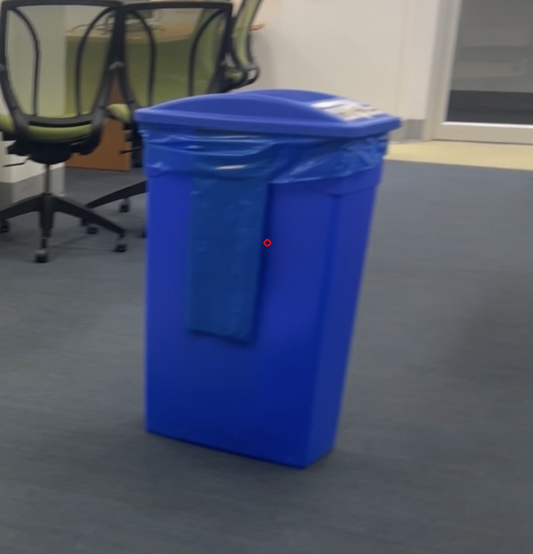
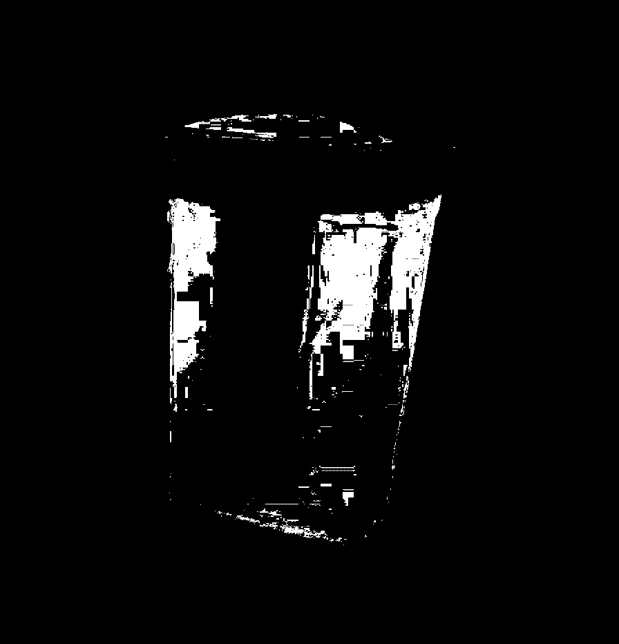
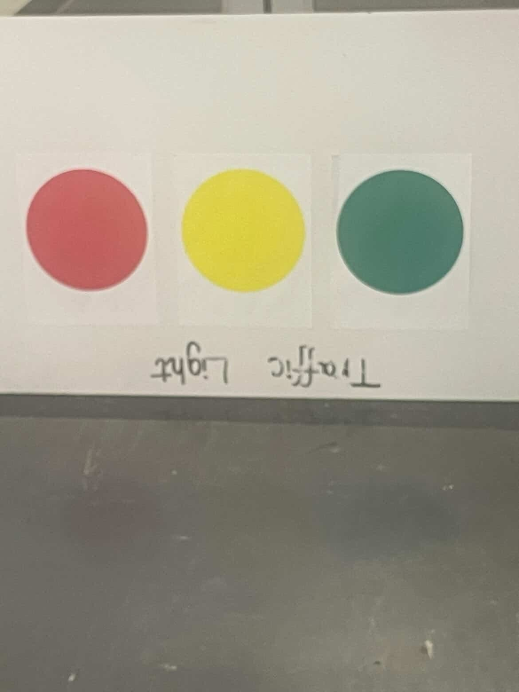
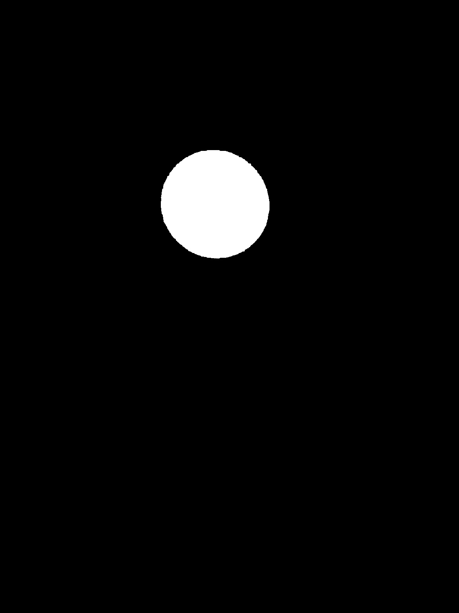
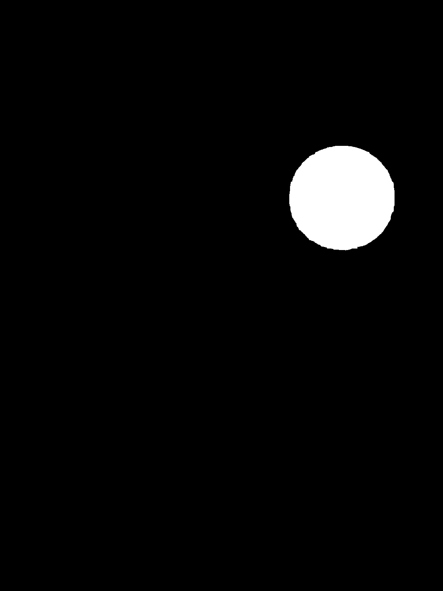

# Autonomous PiCar: Motor Control & Computer Vision System

This Raspberry Pi-based vehicle to features closed-loop **PID motor controls**, real-time **signal processing (FFT)**, and **OpenCV computer vision** for navigation, target tracking, and environment-aware cruise control.

---

## Core Project Objectives & Deliverables

### [Objective 1] Suspended Loop Control (`objective1.py`)
* **Description:** In this objective, I was tasked with implementing closed-loop velocity control on a suspended, no-load vehicle to target a stable 4.0 RPS.
* **Signal Validation:** In order to collect enough data, I tuned the vehicle to utilize a 200 Hz Analog-to-Digital (AD) sampling rate. I validated my real-time calculations using a Fast Fourier Transform (FFT) analysis, confirming a dominant steady-state frequency spike at 7.94 Hz (3.97 RPS).
* **Tuning Parameters:** $K_p = 0.03$, $K_i = 11.0$, $K_d = 0.6$.
* My data is logged in `data/car_noload_4rps.txt`.

### [Objective 2] Ground-Driving Movement (`objective2.py`)
* **Description:** I tracked the vehicle's velocity under full body load and floor friction. The PiCar required aggressive gains to overcome the rolling resistance and static friction.
* **Tuning Parameters:** $K_p = 11.0$, $K_i = 7.0$, $K_d = 0.1$.
* I logged my data in `data/manual_car_[speed]rps.txt`.

### [Objective 3] Autonomous Target Seeker (`objective3.py`)
* **Description:** I programmed the camera to sweep and locate a blue object over 10 feet away. I then aligned the trajectory using a visual geometric center-of-mass (COM) error loop, and I utilized ultrasonic deceleration to park the car safely without collision.
* **Vision Pipeline:** Images taken on the Pi camera was converted from RGB to HSV color space to build a robust binary pixel mask against ambient shadows.
* My execution logs are in `data/Seeker.txt`.

<table>
  <tr>
    <td align="center"><strong>Original RGB & Center of Mass</strong></td>
    <td align="center"><strong>HSV Binary Mask</strong></td>
  </tr>
  <tr>
    <td></td>
    <td></td>
  </tr>
</table>

### [Objective 4] Autonomous Traffic Light System (`objective4.py`)
* **Description:** I achieved direct line driving by utilizing an MPU-6050 accelerometer gyroscope tracker for real-time heading correction.
* **Color Decision Matrix:** I processed three concurrent HSV masks (Red, Yellow, Green). For the Red mask, I utilized a bitwise OR operation to join the split bounds (0–10 and 160–180 Hue).
* **Behavioral Logic:** I designed the system to continue on Green, apply a linear braking deceleration curve on Yellow, and execute a full halt at 170 cm on Red.
* My execution logs are in `data/Traffic_light.txt`.

<table>
  <tr>
    <td align="center"><strong>Original Frame</strong></td>
    <td align="center"><strong>Red Mask</strong></td>
    <td align="center"><strong>Yellow Mask</strong></td>
    <td align="center"><strong>Green Mask</strong></td>
  </tr>
  <tr>
    <td></td>
    <td></td>
    <td></td>
    <td></td>
  </tr>
</table>

### [Objective 5] Hallway Cruise Control (`objective5.py`)
* **Description:** For this cumulative challenge, I drove the vehicle through a hallway grid involving an uphill ramp climb, a wall-bounded 180° three-point turn, and a downhill ramp descent.
* **Dynamics Management:** I raised the parameters ($K_i = 15.0$, $K_d = 0.8$) to counteract gravity. I also built a specialized active braking routine that reverses motor polarity if gravity accelerates the vehicle 1.5 RPS beyond my target threshold.
* My telemetry data is in `data/Objective_5.txt` or `plots/Objective_5.png`.

---

## Academic Citation
For explicit design equations, transfer functions, and full mathematical derivations of my feedforward ratios, please read my complete technical paper:
**[Read my Full Technical Report](picarpaper.pdf)**